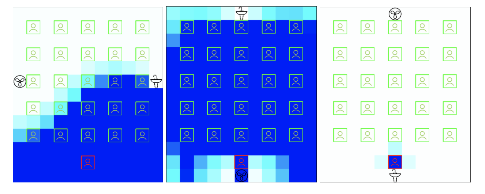

# Agent Based Covid Model
Created: February 1, 2021 \
Last Updated: October 13, 2021

Authors: Jayce Slesar, Brandon Lee, and Carter Ward \
Advisors: Jason H. T. Bates, John P. Hanley, and Vitor Mori \
Affiliation: University of Vermont.

This model was created to simulate the risk of infection to a disease primarily transmitted through aerosols of susceptible individuals in a classroom or office. The model is based on the physics of diffusion and hydraulics and is highly parameterizable allowing for users to tailor simulations.
A heavily paramaterizeable physics simulation to show how aersols spread within enviroments like offices and classrooms

Example output of 3 different simulations (each of these simulations can be recreated using the following json files in place of 'sim_params.json' in main.py, line 12. A: "assets/example_a.json"; B: "assets/example_b.json"; C: "assets/example_c.json") :

## Parameters: (found in sim_params.json) with units
### IMPORTANT: The self.time_length variable in room.py controls the time step. Keeping it at 1 means that each step is 1 second.

| Parameter | Description | Data Type | Default |
| -------- | -----------| ------------| ------- |
| seed | number to seed the simulation with | integer | 42 |
| rows_people | number of rows in the grid | integer | 5 |
| cols_people | number of columns in the grid | integer | 5 |
| have_teacher | will the simulation have a teacher | boolean (true, false) | true |
| moving_agent | will the simulation have a moving agent | boolean (true, false) | false |
| iterations | the number of steps to run the simulation | integer | 3600 |
| fan_cycles | controls the fan animation, don't need to mess with this | integer | 4 |
| window_height | for controlling the size of a cell in the visual, no need to change | integer (pixels) | 800 |
| window_width | for controlling the size of a cell in the visual, no need to change | integer (pixels) | 800 |
| source_row | the row that the source is in (the fan which moves air around) | integer | 12 |
| source_col | the column that the source is in (the fan which moves air around) | integer | 5 |
| source_ach | the air changes per hour of the source | ACH (air changes / hour) | 3 |
| sink_row | the row that the sink is in (the sink image that takes in air) | integer | 0 |
| sink_col | the column that the sink is in (the sink image that takes in air) | integer | 5 |
| sink_ach | the air changes per hour of the source | ACH (air changes / hour) | 4 |
| mic | value to set the teacher have a microphone or not, affects how loudly they are speaking and reduces output of aerosol | boolean (true, false) | false |
| inhale_mask_factor | the affect in terms of % that a mask makes on inhaling for a given agent | float [0, 1] | 1 |
| exhale_mask_factor | the affect in terms of % that a mask makes on exhaling for a given agent | float [0, 1] | 0.05 |
| breathe_volume | volume breathed in per step | (concentration*.0005 cubic meters)*seconds | 0.233 |
| aerosol_mass | mass of a given aerosol | killograms | 5.445427e-20 |
| agent_volume | how much volume an agent takes up in their cell | cubic meters | 0.062 |
| cell_width | width of a cell on the grid | meters | 1 |
| cell_height | height of a cell on the grid | meters | 3 |
| diffusivity | rate of diffusion | square meters per second | 2.83e-5 |
| micro_current_factor | interaction term for micro currents on diffusivity | | 1000 |
| color_upper_limit | limit on cell color for visualization | float | 7.500000e-22 |

An example of a paramater setup can be found in `sim_params.json`. Editing this file will result in a changed simulation.

Production rates from https://www.medrxiv.org/content/10.1101/2021.02.07.21251309v2.full.pdf

# Installation:
Required: python3 and pip

`$ git clone https://github.com/jayceslesar/covid-agents.git` \
`$ cd covid-agents` \
Use of virtual environment is recommended \
`$ pip install -r requirements.txt`

# How to Run:

Running `main.py` with a configuration of `sim_params.json` will run the model.
Upon running, it will ask if you would like to save the data into a directory. Screenshots can be saved to create a .gif of the model run (state how screenshots can be saved). \
A visual will appear to show the current state of the simulation. Darker blue means a greater concentration of an aerosol that contains an infectious agent (e.g., SARS-CoV-2).
Ex: `python3 main.py` will run a simulation and show the visual.

lines after questions are where the user (you enters answers) \
$ python3 main.py \
pygame 2.0.2 (SDL 2.0.16, Python 3.8.11) \
Hello from the pygame community. https://www.pygame.org/contribute.html \
Simulation will run for 3600 steps. \
What would you like to name the data file? some_data \
do you want screenshots? \
y \
What folder do you want to save your screenshots into? Please specify the path \
save_screenshots \
How many steps between screenshots? \
10

# General Usage:

Users will generally want to simulate an environment that most resembles a room that they plan on working and/or teaching in. Therefore, users should familiarize themselves with the parameters listed above so that the simulation most closely resembles the system they choose to model. \
The data output into the `data` folder is a csv where each row is a different cell with an agent at a timestep. Blank spaces are excluded so it is easier to analyze how much total infected aerosol a given agent as inhaled.

# References:
## Production Rates:
Wilson, Nick M., Guy B. Marks, Andrew Eckhardt, Alyssa Clarke, Francis Young, Frances L. Garden, Warren Stewart, Tim M. Cook, and Euan R. Tovey. “The Effect of Respiratory Activity, Ventilatory Therapy and Facemasks on Total Aerosol Emissions.” Preprint. Infectious Diseases (except HIV/AIDS), February 9, 2021. https://doi.org/10.1101/2021.02.07.21251309.

Edwards, David A., Dennis Ausiello, Jonathan Salzman, Tom Devlin, Robert Langer, Brandon J. Beddingfield, Alyssa C. Fears, et al. “Exhaled Aerosol Increases with COVID-19 Infection, Age, and Obesity.” Proceedings of the National Academy of Sciences 118, no. 8 (February 23, 2021): e2021830118. https://doi.org/10.1073/pnas.2021830118.

Riediker, Michael, and Dai-Hua Tsai. “Estimation of Viral Aerosol Emissions From Simulated Individuals With Asymptomatic to Moderate Coronavirus Disease 2019.” JAMA Network Open 3, no. 7 (July 27, 2020): e2013807. https://doi.org/10.1001/jamanetworkopen.2020.13807.

Ma, Jianxin, Xiao Qi, Haoxuan Chen, Xinyue Li, Zheng Zhang, Haibin Wang, Lingli Sun, et al. “Coronavirus Disease 2019 Patients in Earlier Stages Exhaled Millions of Severe Acute Respiratory Syndrome Coronavirus 2 Per Hour.” Clinical Infectious Diseases 72, no. 10 (May 18, 2021): e652–54. https://doi.org/10.1093/cid/ciaa1283.

## Breath Capacity:
“Lung Volumes and Vital Capacity - Cardio-Respiratory System - Eduqas - GCSE Physical Education Revision - Eduqas - BBC Bitesize.” Accessed October 20, 2021. https://www.bbc.co.uk/bitesize/guides/z3xq6fr/revision/2.

## Breaths per Minute:
“Vital Signs (Body Temperature, Pulse Rate, Respiration Rate, Blood Pressure) | Johns Hopkins Medicine.” Accessed October 20, 2021. https://www.hopkinsmedicine.org/health/conditions-and-diseases/vital-signs-body-temperature-pulse-rate-respiration-rate-blood-pressure.

## Inactivation Rate of COVID-19:
“Coronavirus Can Persist in Air for Hours and on Surfaces for Days: Study | Reuters.” Accessed October 20, 2021. https://www.reuters.com/article/us-health-coronavirus-study/coronavirus-can-persist-in-air-for-hours-and-on-surfaces-for-days-study-idUSKBN2143QP.

## Aerosol Info:
Baron, Paul. “Generation and Behavior of Airborne Particles (Aerosols),” n.d., 40.

http://web.mit.edu/fluids-modules/www/low_speed_flows/2-7Aerosol.pdf
